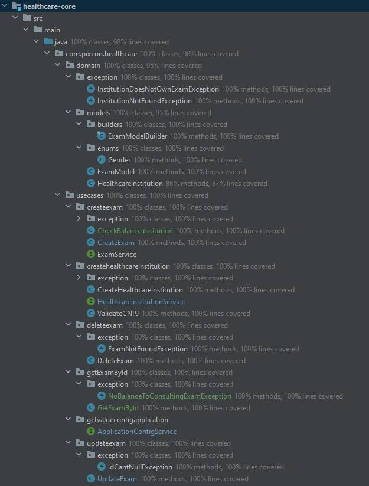

# WORK IN PROGRESS
# Registro de Horas
Textos redigidos com teclado padrão En-us.
(Quinta-Feira 05 de Novembro de 2020) Start 19:32, End 22:19
 - `Criando estrutura inical do projeto`
 - `Criando teste de caso de uso "CreateHealthcare`
 
 (Sexta-Feira 06 de Novembro de 2020) Start 18:57, End 22:37
  - `Criar um Exame`
  - `Cada exame criado com sucesso deve cobrar 1 moeda pixeon do bugdet da instituição de saúde`
 
 (Sábado 14 de Novembro de 2020) Start 09:13, End 10:47
  - `Atualizar um Exame`
  - `Deve permitir atualizar um exame se todos os dados obrigatórios estiverem preenchidos, incluindo ID.`
  - `Uma instituição de saúde não deve ter acesso a atualizar um exame que pertença a outra instituição de saúde.`
   
 (Sábado 14 de Novembro de 2020) Start 11:04, End 15:09
  - `Deletear um Exame`
  - `Deve permitir deletar um exame quando existir o exame.`
  - `Uma instituição de saúde não deve ter acesso a deletar um exame que pertença a outra instituição de saúde.`
  - `OBS: Algunas alteracoes no componente de ExameService foram necessarios para evitar duplicidade de codigos`
  - `Atualizacoes em testes para melhor cobertura foram feitos` 
     
 (Sábado 14 de Novembro de 2020) Start 18:34, End 22:41
  - `Obter um exame`
  - `Uma instituição de saúde não deve ter acesso a um exame que pertença a outra instituição de saúde.`
  - `Uma instituição de saúde não tem permissão para criar ou fazer um exame quando está sem orçamento.`
  
 (Domingo 15 de Novembro de 2020) Start 09:01, End 11:56 
  - `Modelos proposta de arquitetura`
  - `Criando de dados`
  - `Criando servico de descoberta de servico`
  
   
 #### Coverage
  
  
 
 
 ### Arquitetura
 Como proposta e seguindo o desafio criei um modelo de arquiterura para nossa aplicação escalavel. 
  
 
 ### Diagrama de dados
 Para nosso desafio escolhemos H2 como nossa base de dados, isso para facilitar no momento que os avaliadores possam
 testar a aplicacao, outro ponto, que vai no ajudar em nossos teste de integração. 
 
 
# Pixeon-core
Esse projeto seguindo práticas de Clean Architecture foi colocado toda a parte de domínio de negócio da empresa
e foi o primeiro projeto criado seguindo práticas de TDD. Dentro possui um [README.md](/healthcare-core/README.md) descrevendo as implementações
e casos de uso.

