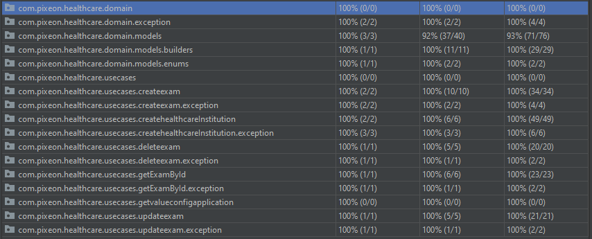

# Pixeon-core
#### Observações
- Como regra de Clean Architecture projeto não pode ter dependências com libs externas, salve unidades de teste.
- A classe [ValidateCNPJ.java](/src/main/java/com/pixeon/healthcare/usecases/createhealthcareInstitution/ValidateCNPJ.java) eu encontrei na internet, fiz algumas refatorações.
## Use Cases  
Como o projeto já tem uma definição de negócio, vamos começar pela implementação dos casos de uso do negócio usado a prática TDD.  
  
#### Create a Healthcare
- Permite criar uma nova instituição e adicionar COINs para negociações.

> Requisitos funcionais:
> - Cada nova instituição de saúde deve receber 20 moedas pixeon para salvar os exames e recuperá-los.
> - Resultado: 

#### Create a Exam
 - Criar um Exame
> Requisitos funcionais:
> - Cada exame criado com sucesso deve cobrar 1 moeda pixeon do bugdet da instituição de saúde

#### Update a Exam
 - Atualizar um Exame
> Requisitos funcionais:
> - Deve permitir atualizar um exame se todos os dados obrigatórios estiverem preenchidos, incluindo ID.

#### Delete a Exam
 - Deletar um Exame
> Requisitos funcionais:
> - Uma instituição de saúde não deve ter acesso a deletar um exame que pertença a outra instituição de saúde.`
> - OBS: Algunas alteracoes no componente de ExameService foram necessarios para evitar duplicidade de codigos`
> - Atualizacoes em testes para melhor cobertura foram feitos`

#### Get a Exam
 - Obter um Exame
> Requisitos funcionais:
> - Uma instituição de saúde não deve ter acesso a um exame que pertença a outra instituição de saúde.`
> - Uma instituição de saúde não tem permissão para criar ou fazer um exame quando está sem orçamento.`

#